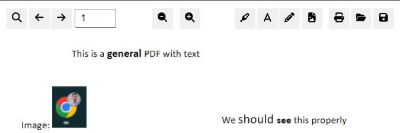
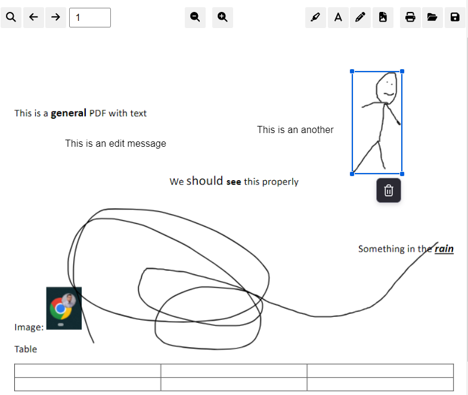

# 🚀 Neo-PDF

[](https://github.com/Reterics/neo-pdf/actions/workflows/npm-build-test.yml)

A React Component for reading and editing PDF documents based on the official [PDF.js project](https://github.com/mozilla/pdf.js), therefore the main dependency of this project is [pdfjs-dist npm package](https://www.npmjs.com/package/pdfjs-dist).



## Getting started

For installing and building locally, you can use the following:
```bash
npm install
npm run build:dev
```

or _you can download the package from npm registry (soon)_

### Example projects

You can find usage examples in **examples** folder like **getting_started**.
It has working examples how you can use this component in your project.




## Contribute

There are many ways to [contribute](./CONTRIBUTING.md) to Neo-PDF.
* [Submit bugs](https://github.com/Reterics/neo-pdf/issues) and help us verify fixes as they are checked in.
* Review the [source code changes](https://github.com/Reterics/neo-pdf/pulls).
* [Contribute bug fixes](https://github.com/Reterics/neo-pdf/blob/main/CONTRIBUTING.md).

